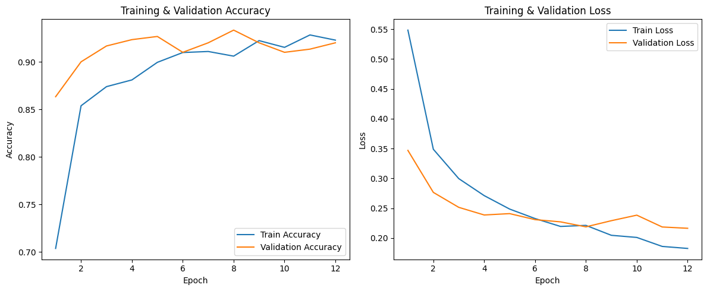

# Car Damage Detection (Deep Learning)

## Overview
This project focuses on binary image classification to detect vehicle damage using transfer learning with MobileNetV2. The goal is to evaluate different training configurations and identify the best-performing model for car damage detection.

## Problem Statement
Automatic car damage detection is an important task for insurance assessment, vehicle inspection, and automation in the automotive domain. This project explores whether transfer learning can effectively classify damaged vs. undamaged vehicles from images.

## Dataset
The model is trained on labeled car images representing damaged and undamaged vehicles.
> Dataset is not included in the repository due to size constraints.

## Methodology
- Image preprocessing and resizing
- Transfer learning using MobileNetV2
- Multiple experimental configurations:
  - Different dropout rates
  - Epoch variations
  - Data augmentation vs. no augmentation
- Model evaluation using accuracy and loss metrics

## Results
- Best model: MobileNetV2 (transfer learning)
- Test accuracy: **93.48%**
- Best configuration: Single Dropout (0.3), 12 epochs
- Notably, the best result was achieved **without data augmentation**

## Model Performance
The following figure shows training and validation accuracy and loss curves for the best-performing configuration. The close alignment between training and validation curves indicates strong generalization without overfitting.

The model converges smoothly and achieves high performance without requiring data augmentation.

## Tools & Technologies
- Python
- TensorFlow / Keras
- MobileNetV2
- NumPy, Matplotlib
- Jupyter Notebook
